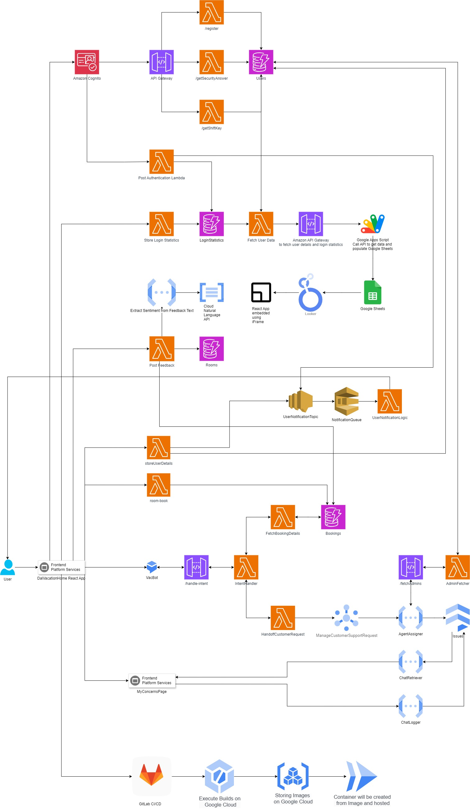

# DalVacationHome

## Overview

DalVacationHome is a serverless web application developed to manage vacation home bookings, user interactions, and virtual assistance. The application uses a multi-cloud deployment model and Backend-as-a-Service (BaaS) architecture, leveraging AWS and Google Cloud Platform (GCP) services to provide a robust and scalable experience. The application allows guests, registered customers, and property agents to interact with the platform based on their roles, utilizing features like room booking, feedback submission, and virtual assistance.

## Features

### For Guests

- **View Room Availability and Tariffs**: Guests can check the availability and pricing of different types of rooms and recreation facilities.
- **Access Virtual Assistant**: A chatbot built using Google Dialogflow helps guests navigate the site and provides basic information.
- **View Feedback and Ratings**: Guests can view feedback and overall ratings for specific rooms.

### For Registered Customers

- **Multi-Factor Authentication**: Registered customers must complete multi-factor authentication (using password, security questions, and a Caesar cipher challenge) to access their accounts.
- **Book Rooms**: Customers can book rooms and recreation facilities for specified periods.
- **Enhanced Virtual Assistant**: The chatbot provides additional functionalities such as booking management and direct communication with property agents.
- **Provide Feedback**: Customers can submit feedback on their stay and facilities.

### For Property Agents

- **Manage Rooms**: Agents can add or update room details, set prices, add discounts, and manage room features.
- **Respond to Customer Queries**: Agents can receive and respond to customer queries through an integrated messaging system.
- **View Analytics**: Agents have access to data analytics and user statistics through embedded dashboards.

## Architecture



The DalVacationHome application is built using a combination of AWS and Google Cloud services to achieve a serverless, scalable architecture:

- **User Management and Authentication**: Utilizes AWS Cognito for user authentication and AWS Lambda functions in Node.js for multi-factor authentication, with data stored in DynamoDB.
- **Virtual Assistant Module**: Built using Google Dialogflow for natural language processing, integrated with AWS Lambda functions (Node.js) to handle backend logic.
- **Messaging System**: Implements Google Cloud Pub/Sub for asynchronous messaging between customers and property agents, with message logs stored in Firestore.
- **Notifications**: AWS SNS and SQS are used to send notifications for various user actions like successful registration, login, and booking confirmations.
- **Data Storage and Analysis**: Uses AWS DynamoDB and Google Cloud Storage for storing user and booking data. Google Looker Studio is used for data visualization and analytics.

## Technology Stack

- **Frontend**: React, integrated with Google Dialogflow for chatbot functionality.
- **Backend**: AWS Lambda (Node.js), Google Cloud Functions.
- **Authentication**: AWS Cognito.
- **Database**: AWS DynamoDB, Google Firestore.
- **Messaging and Notification**: Google Cloud Pub/Sub, AWS SNS, and SQS.
- **Data Analysis and Visualization**: Google Looker Studio.
- **Hosting**: GCP Cloud Run for hosting the frontend application.

## Setup and Deployment

### Prerequisites

1. **AWS Account**: Required for setting up Cognito, Lambda functions, DynamoDB, SNS, and SQS.
2. **Google Cloud Platform Account**: Needed for Dialogflow, Cloud Functions, Firestore, and Cloud Run.
3. **Node.js and npm**: For running the frontend React application and backend Node.js Lambda functions.

### Deployment Steps

1. **Clone the Repository**:

   ```bash
   git clone https://github.com/ChristinSaji/DalVacationHome.git
   cd DalVacationHome
   ```

2. **Install Frontend Dependencies**:

   ```bash
   cd frontend
   npm install
   ```

3. **Run the Application Locally**:

   ```bash
   npm start
   ```

4. **Deploy Backend Services**:

   - **AWS Services**: Deploy AWS Lambda functions (Node.js) using the AWS Management Console or AWS CLI, set up AWS Cognito for user management, and configure DynamoDB tables.
   - **Google Cloud Services**: Deploy Dialogflow agents, Cloud Functions, and set up Firestore.

5. **Deploy Frontend to Cloud Run**:
   - Build the frontend application:
     ```bash
     npm run build
     ```
   - Deploy the built application to GCP Cloud Run following the instructions provided in the GCP Console.

## Usage

- **Guests**: Navigate the site to view room availability and use the chatbot for basic information.
- **Registered Customers**: Log in using multi-factor authentication to book rooms, manage bookings, and communicate with property agents.
- **Property Agents**: Log in to manage room details, respond to customer queries, and access analytics.
